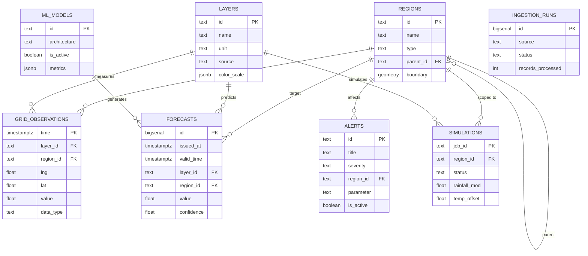

# Data Schema Document
## AI-Powered Digital Twin of India's Climate

**Author:** Engineering  
**Team:** SHIV-SAKTI  
**Context:** Bharatiya Antariksh Hackathon 2026, Problem Statement 5  
**Version:** v1.0  
**Status:** Draft  
**Companion docs:** [PRD.md](./PRD.md), [TRD.md](./TRD.md), [FLOW.md](./FLOW.md)

---

## 1. Overview

This document defines every data structure used in the India Climate Twin platform — from TypeScript interfaces consumed by the frontend, to database table schemas for the Phase 1 backend, to API request/response contracts. It is the single source of truth for data shapes across the entire system.

**Scope:**
- **Section 2:** Frontend TypeScript interfaces (Phase 0 + Phase 1)
- **Section 3:** Mock data fixture formats (Phase 0)
- **Section 4:** API request/response schemas (Phase 1)
- **Section 5:** Database schemas (Phase 1)
- **Section 6:** Enums and constants

---

## 2. Frontend TypeScript Interfaces

### 2.1 Core Domain Types

```typescript
// ─── Geographic Primitives ─────────────────────────────────────────────

/** Longitude, Latitude pair (GeoJSON convention: [lng, lat]) */
type MapCoordinates = [longitude: number, latitude: number]

/** Bounding box: southwest corner, northeast corner */
type MapBounds = [southwest: MapCoordinates, northeast: MapCoordinates]

/** Ordered array of coordinates forming a path */
type MapPath = MapCoordinates[]

// ─── Regions ───────────────────────────────────────────────────────────

interface Region {
  /** Unique identifier (e.g., "western-ghats", "kerala", "kannur") */
  id: string
  /** Display name (e.g., "Western Ghats", "Kerala", "Kannur District") */
  name: string
  /** Region type for hierarchy */
  type: "macro-region" | "state" | "district"
  /** Parent region ID (null for top-level) */
  parentId: string | null
  /** Map center when this region is selected */
  center: MapCoordinates
  /** Default zoom level for this region */
  zoom: number
  /** Bounding box for map fitBounds */
  bounds: MapBounds
  /** Whether mock data exists for this region (Phase 0) */
  hasData: boolean
}

interface RegionList {
  regions: Region[]
  defaultRegionId: string  // "western-ghats" for Phase 0
}
```

### 2.2 Climate Data Layers

```typescript
// ─── Layer Definitions ─────────────────────────────────────────────────

/** The three data layers specified in the PRD */
type LayerId = "insat-lst" | "imd-rainfall" | "ocean-sst"

/** Extended parameter set used in the current implementation */
type ParameterId = "temp" | "precip" | "humidity" | "wind" | "solar"

interface LayerDefinition {
  id: LayerId
  /** Display label */
  name: string
  /** Short description */
  description: string
  /** Physical unit */
  unit: string
  /** Color scale endpoints [min, max] */
  colorScale: {
    min: { value: number; color: string }
    max: { value: number; color: string }
    /** Intermediate stops for gradient */
    stops: Array<{ value: number; color: string }>
  }
  /** Valid value range */
  range: { min: number; max: number }
  /** Source attribution */
  source: "INSAT-3D" | "IMD" | "ERA5" | "Simulated"
  /** Icon identifier (Lucide icon name) */
  icon: string
}

interface LayerState {
  /** INSAT Land Surface Temperature — checked/unchecked */
  "insat-lst": boolean
  /** IMD Rainfall — checked/unchecked */
  "imd-rainfall": boolean
  /** Ocean Sea Surface Temperature — checked/unchecked */
  "ocean-sst": boolean
}

/** Default layer state per FLOW.md §2.2 */
const DEFAULT_LAYER_STATE: LayerState = {
  "insat-lst": false,
  "imd-rainfall": true,   // Only rainfall is ON by default
  "ocean-sst": false,
}
```

### 2.3 Grid Data

```typescript
// ─── Heatmap / Grid Data ───────────────────────────────────────────────

interface GridPoint {
  /** Unique point identifier (e.g., "grid-0001") */
  id: string
  /** Station/node name (e.g., "STN-KER-0042") */
  name: string
  /** State/UT name the point falls within */
  state: string
  /** Geographic position */
  coordinates: MapCoordinates
  /** Climate value at this point */
  value: number
  /** Normalized weight for heatmap rendering (0–100) */
  weight: number
}

interface GridData {
  /** GeoJSON FeatureCollection of grid points */
  type: "FeatureCollection"
  features: GridFeature[]
}

interface GridFeature {
  type: "Feature"
  geometry: {
    type: "Point"
    coordinates: [number, number]
  }
  properties: GridPoint
}

interface GridStats {
  /** Total number of grid nodes */
  pointCount: number
  /** Minimum value in the grid */
  min: number
  /** Maximum value in the grid */
  max: number
  /** Mean value across all grid nodes */
  avg: number
  /** Standard deviation */
  stdDev?: number
  /** Top 3 states by highest average value */
  topHighest: StateAverage[]
  /** Top 3 states by lowest average value */
  topLowest: StateAverage[]
}

interface StateAverage {
  state: string
  value: number
}

// ─── GeoJSON State Boundaries ──────────────────────────────────────────

interface StateFeature {
  type: "Feature"
  geometry: {
    type: "Polygon" | "MultiPolygon"
    coordinates: number[][][] | number[][][][]
  }
  properties: {
    /** State name (e.g., "Kerala", "Rajasthan") */
    ST_NM: string
    /** Optional: state/UT code */
    ST_CD?: number
    /** Optional: census code */
    CENSUS_CD?: string
  }
}

interface StateFeatureCollection {
  type: "FeatureCollection"
  features: StateFeature[]
}
```

### 2.4 Simulation State

```typescript
// ─── What-If Simulation ────────────────────────────────────────────────

interface SimulationParams {
  /** Rainfall modification percentage (-50 to +50) */
  rainfallMod: number
  /** Temperature offset in °C (-2 to +5) */
  tempOffset: number
}

interface SimulationState {
  /** Current slider values (may differ from last-run values) */
  pending: SimulationParams
  /** Values from the last "Run Simulation" click (null if never run) */
  applied: SimulationParams | null
  /** Whether the map is currently showing what-if results */
  isActive: boolean
  /** Whether a simulation is currently computing */
  isRunning: boolean
}

/** Default simulation state per FLOW.md §2.3 */
const DEFAULT_SIMULATION_STATE: SimulationState = {
  pending: { rainfallMod: 0, tempOffset: 0 },
  applied: null,
  isActive: false,
  isRunning: false,
}

/** Simulation result returned by the API (Phase 1) */
interface SimulationResult {
  /** Unique job identifier */
  jobId: string
  /** Job status */
  status: "pending" | "running" | "completed" | "failed"
  /** Input parameters */
  params: SimulationParams
  /** Region the simulation was run for */
  regionId: string
  /** Base date the simulation started from */
  baseDate: string  // ISO 8601
  /** Modified grid data (only present when status === "completed") */
  gridData?: GridData
  /** Modified stats */
  gridStats?: GridStats
  /** Computation time in milliseconds */
  computeTimeMs?: number
  /** Error message (only present when status === "failed") */
  error?: string
}
```

### 2.5 Time Controls State

```typescript
// ─── Time Navigation ───────────────────────────────────────────────────

interface TimeState {
  /** Currently selected date */
  currentDate: string  // ISO 8601 date string "YYYY-MM-DD"
  /** Available date range in the dataset */
  availableRange: DateRange
  /** Index of "now" — divides observed from forecasted */
  nowIndex: number
  /** Whether auto-playback is active */
  isPlaying: boolean
  /** Playback speed in milliseconds per step */
  playbackIntervalMs: number
}

interface DateRange {
  /** First available date (oldest observation) */
  start: string  // ISO 8601
  /** Last available date (furthest forecast) */
  end: string    // ISO 8601
  /** Array of all available dates in order */
  dates: string[]
}

/** Date entry metadata */
interface DateEntry {
  date: string  // ISO 8601 "YYYY-MM-DD"
  /** Whether this date represents observed or forecasted data */
  type: "observed" | "forecasted"
  /** Whether grid data exists for this date */
  hasData: boolean
}

/** Default time state per FLOW.md §2.5 */
const DEFAULT_TIME_STATE: TimeState = {
  currentDate: "",          // Set to "now" date on initialization
  availableRange: {
    start: "",
    end: "",
    dates: [],
  },
  nowIndex: 0,
  isPlaying: false,
  playbackIntervalMs: 1000, // 1 second per day
}
```

### 2.6 Anomaly Alerts

```typescript
// ─── Alerts ────────────────────────────────────────────────────────────

type AlertSeverity = "info" | "warning" | "critical"

interface Alert {
  /** Unique alert identifier */
  id: string
  /** Short alert title (e.g., "Extreme Heat Warning: Zone 4B") */
  title: string
  /** Detailed description */
  description: string
  /** Alert severity level */
  severity: AlertSeverity
  /** Affected region ID */
  regionId: string
  /** Affected zone/area name (display string) */
  affectedZone: string
  /** Date range the alert applies to */
  dateRange: {
    start: string  // ISO 8601
    end: string    // ISO 8601
  }
  /** Associated climate parameter */
  parameter: ParameterId | LayerId
  /** Threshold value that triggered the alert */
  thresholdValue?: number
  /** Observed/forecasted value that exceeded the threshold */
  observedValue?: number
  /** Geographic center of the alert zone (for "View on map" action) */
  coordinates?: MapCoordinates
  /** Timestamp when the alert was issued */
  issuedAt: string  // ISO 8601
  /** Whether the alert is currently active */
  isActive: boolean
}

/** Alert chip as rendered in the alerts bar */
interface AlertChip {
  id: string
  title: string
  severity: AlertSeverity
  /** Truncated description for inline display */
  shortDescription: string
}
```

### 2.7 Application UI State

```typescript
// ─── UI / Loading / Error States ───────────────────────────────────────

interface UIState {
  /** Whether the app is in a global loading state */
  isLoading: boolean
  /** Loading message to display */
  loadingMessage: string | null
  /** Global error state */
  error: AppError | null
  /** Whether the sidebar drawer is open (tablet breakpoint) */
  isSidebarOpen: boolean
  /** Currently open alert detail (null = none open) */
  activeAlertDetail: string | null
}

interface AppError {
  /** Machine-readable error code */
  code: ErrorCode
  /** Human-readable error message */
  message: string
  /** Whether a retry action is available */
  retryable: boolean
}

type ErrorCode =
  | "DATA_LOAD_FAILED"
  | "REGION_NOT_FOUND"
  | "SIMULATION_FAILED"
  | "NETWORK_ERROR"
  | "GEOJSON_PARSE_ERROR"
  | "DATE_NOT_AVAILABLE"

/** Composite root state shape (for Zustand store in Phase 1) */
interface AppState {
  // Domain state
  region: Region
  layers: LayerState
  simulation: SimulationState
  time: TimeState
  alerts: Alert[]
  gridData: GridData | null
  gridStats: GridStats | null

  // UI state
  ui: UIState

  // Selected inspection target
  selectedNode: GridPoint | null

  // Actions
  setRegion: (regionId: string) => void
  toggleLayer: (layerId: LayerId) => void
  setSimulationParam: (key: keyof SimulationParams, value: number) => void
  runSimulation: () => Promise<void>
  resetSimulation: () => void
  setCurrentDate: (date: string) => void
  togglePlayback: () => void
  stepForward: () => void
  stepBackward: () => void
  skipToStart: () => void
  skipToEnd: () => void
  selectNode: (node: GridPoint | null) => void
  dismissAlert: (alertId: string) => void
}
```

### 2.8 Telemetry Log (Phase 0 Simulation)

```typescript
// ─── Telemetry Stream (Phase 0 Mock) ───────────────────────────────────

interface TelemetryLogEntry {
  /** Timestamp string (e.g., "11:42:15 AM") */
  timestamp: string
  /** Log message type */
  type: "telemetry" | "system" | "alert" | "error"
  /** Full formatted log message */
  message: string
  /** Whether this is the most recent entry (for highlight styling) */
  isLatest: boolean
}

/** Telemetry stream configuration */
interface TelemetryConfig {
  /** Interval between log entries in milliseconds */
  intervalMs: number  // default: 1800
  /** Maximum number of log entries to retain */
  maxEntries: number  // default: 19
  /** PRNG seed for deterministic output */
  seed: number
}
```

---

## 3. Mock Data Fixtures (Phase 0)

### 3.1 Region Fixtures

```typescript
// src/data/regions.ts

const MOCK_REGIONS: Region[] = [
  {
    id: "western-ghats",
    name: "Western Ghats",
    type: "macro-region",
    parentId: null,
    center: [75.5, 13.0],
    zoom: 6.5,
    bounds: [[72.5, 8.0], [78.5, 21.0]],
    hasData: true,
  },
  {
    id: "kerala",
    name: "Kerala",
    type: "state",
    parentId: "western-ghats",
    center: [76.3, 10.5],
    zoom: 7.5,
    bounds: [[74.8, 8.2], [77.5, 12.8]],
    hasData: true,
  },
  {
    id: "kannur",
    name: "Kannur District",
    type: "district",
    parentId: "kerala",
    center: [75.4, 11.9],
    zoom: 9.5,
    bounds: [[74.8, 11.5], [76.0, 12.3]],
    hasData: true,
  },
  {
    id: "kozhikode",
    name: "Kozhikode District",
    type: "district",
    parentId: "kerala",
    center: [75.8, 11.2],
    zoom: 9.5,
    bounds: [[75.3, 10.8], [76.3, 11.6]],
    hasData: true,
  },
  {
    id: "wayanad",
    name: "Wayanad District",
    type: "district",
    parentId: "kerala",
    center: [76.1, 11.7],
    zoom: 10,
    bounds: [[75.7, 11.4], [76.5, 12.0]],
    hasData: true,
  },
]

const DEFAULT_REGION_ID = "western-ghats"
```

### 3.2 Alert Fixtures

```typescript
// src/data/alerts.ts

const MOCK_ALERTS: Alert[] = [
  {
    id: "alert-001",
    title: "Extreme Heat Warning: Zone 4B",
    description: "Thar Desert core sectors (Jaisalmer, Barmer) reporting temperatures exceeding 45.5°C. Sustained high temperatures expected for the next 48 hours.",
    severity: "critical",
    regionId: "western-ghats",
    affectedZone: "Zone 4B — Jaisalmer Sector",
    dateRange: { start: "2026-06-18", end: "2026-06-22" },
    parameter: "temp",
    thresholdValue: 45.0,
    observedValue: 47.2,
    coordinates: [70.9, 26.9],
    issuedAt: "2026-06-18T06:00:00Z",
    isActive: true,
  },
  {
    id: "alert-002",
    title: "Monsoon Delay Risk: Moderate",
    description: "Southwest monsoon onset over Kerala delayed by 3–5 days from climatological normal. Agricultural advisories issued for Malabar coast.",
    severity: "warning",
    regionId: "kerala",
    affectedZone: "Malabar Coast — Northern Kerala",
    dateRange: { start: "2026-06-15", end: "2026-06-25" },
    parameter: "imd-rainfall",
    coordinates: [75.8, 11.2],
    issuedAt: "2026-06-15T12:00:00Z",
    isActive: true,
  },
  {
    id: "alert-003",
    title: "Orographic Downpour Advisory",
    description: "Western Ghats windward slopes expected to receive 150–200mm rainfall in the next 24 hours. Landslide risk elevated in Wayanad and Idukki.",
    severity: "warning",
    regionId: "western-ghats",
    affectedZone: "Western Ghats Windward — Agumbe to Ooty",
    dateRange: { start: "2026-06-19", end: "2026-06-21" },
    parameter: "imd-rainfall",
    thresholdValue: 150,
    observedValue: 187,
    coordinates: [75.9, 13.5],
    issuedAt: "2026-06-19T00:00:00Z",
    isActive: true,
  },
  {
    id: "alert-004",
    title: "SST Anomaly: Arabian Sea Warming",
    description: "Sea surface temperatures in the Arabian Sea 1.2°C above seasonal average. May intensify monsoon moisture transport.",
    severity: "info",
    regionId: "western-ghats",
    affectedZone: "Arabian Sea — Lakshadweep Basin",
    dateRange: { start: "2026-06-10", end: "2026-06-30" },
    parameter: "ocean-sst",
    thresholdValue: 29.5,
    observedValue: 30.7,
    coordinates: [72.0, 10.0],
    issuedAt: "2026-06-10T18:00:00Z",
    isActive: true,
  },
]
```

### 3.3 Date Range Fixture

```typescript
// src/data/dates.ts

/** 5 days observed (past) + 3 days forecasted (future) per PRD §6 */
const MOCK_DATE_RANGE: DateRange = {
  start: "2026-06-15",
  end: "2026-06-22",
  dates: [
    "2026-06-15",  // observed
    "2026-06-16",  // observed
    "2026-06-17",  // observed
    "2026-06-18",  // observed
    "2026-06-19",  // observed  ← "Now"
    "2026-06-20",  // forecasted
    "2026-06-21",  // forecasted
    "2026-06-22",  // forecasted
  ],
}

const MOCK_DATE_ENTRIES: DateEntry[] = [
  { date: "2026-06-15", type: "observed",   hasData: true },
  { date: "2026-06-16", type: "observed",   hasData: true },
  { date: "2026-06-17", type: "observed",   hasData: true },
  { date: "2026-06-18", type: "observed",   hasData: true },
  { date: "2026-06-19", type: "observed",   hasData: true },
  { date: "2026-06-20", type: "forecasted", hasData: true },
  { date: "2026-06-21", type: "forecasted", hasData: true },
  { date: "2026-06-22", type: "forecasted", hasData: true },
]

const NOW_DATE = "2026-06-19"
const NOW_INDEX = 4
```

### 3.4 Layer Definitions

```typescript
// src/data/layers.ts

const LAYER_DEFINITIONS: LayerDefinition[] = [
  {
    id: "insat-lst",
    name: "INSAT LST",
    description: "Land Surface Temperature from INSAT-3D/3DR thermal infrared band",
    unit: "°C",
    colorScale: {
      min: { value: -5, color: "#1e3cb4" },
      max: { value: 48, color: "#a00a0a" },
      stops: [
        { value: 5, color: "#2864dc" },
        { value: 15, color: "#3cb4dc" },
        { value: 22, color: "#50c8a0" },
        { value: 28, color: "#8cdc50" },
        { value: 33, color: "#dcdc32" },
        { value: 37, color: "#fab41e" },
        { value: 40, color: "#fa641e" },
        { value: 44, color: "#dc2814" },
      ],
    },
    range: { min: -8, max: 48 },
    source: "INSAT-3D",
    icon: "Thermometer",
  },
  {
    id: "imd-rainfall",
    name: "IMD Rainfall",
    description: "Gridded rainfall analysis from India Meteorological Department ground stations",
    unit: "mm",
    colorScale: {
      min: { value: 0, color: "#fef08a" },
      max: { value: 4500, color: "#1e3a8a" },
      stops: [
        { value: 200, color: "#d9f99d" },
        { value: 500, color: "#86efac" },
        { value: 1000, color: "#34d399" },
        { value: 2000, color: "#06b6d4" },
        { value: 3000, color: "#2563eb" },
      ],
    },
    range: { min: 0, max: 4800 },
    source: "IMD",
    icon: "CloudRain",
  },
  {
    id: "ocean-sst",
    name: "Ocean SST",
    description: "Sea Surface Temperature from ERA5 reanalysis / INSAT-3D",
    unit: "°C",
    colorScale: {
      min: { value: 20, color: "#2447B8" },
      max: { value: 32, color: "#E23B3B" },
      stops: [
        { value: 23, color: "#3cb4dc" },
        { value: 26, color: "#F2C245" },
        { value: 29, color: "#fa641e" },
      ],
    },
    range: { min: 18, max: 34 },
    source: "ERA5",
    icon: "Waves",
  },
]
```

---

## 4. API Schemas (Phase 1)

### 4.1 Request Schemas

```typescript
// ─── GET /api/v1/data/observed ─────────────────────────────────────────

interface ObservedDataRequest {
  /** Region ID to fetch data for */
  regionId: string
  /** Layer to fetch */
  layerId: LayerId
  /** Date (ISO 8601) */
  date: string
  /** Grid resolution in degrees */
  resolution?: number  // default: 0.25
}

// ─── GET /api/v1/data/forecast ─────────────────────────────────────────

interface ForecastDataRequest {
  regionId: string
  layerId: LayerId
  /** Start date of forecast range */
  startDate: string
  /** End date of forecast range */
  endDate: string
  resolution?: number
}

// ─── POST /api/v1/simulate ─────────────────────────────────────────────

interface SimulationRequest {
  regionId: string
  /** Base date to apply perturbation from */
  baseDate: string
  /** Rainfall modification (-50 to +50) */
  rainfallMod: number
  /** Temperature offset in °C (-2 to +5) */
  tempOffset: number
  /** Layer to simulate */
  layerId?: LayerId  // default: active layer
  resolution?: number
}

// ─── GET /api/v1/alerts ────────────────────────────────────────────────

interface AlertsRequest {
  regionId?: string
  /** Filter by severity */
  severity?: AlertSeverity
  /** Date range filter */
  startDate?: string
  endDate?: string
  /** Only return active alerts */
  activeOnly?: boolean  // default: true
  /** Pagination */
  limit?: number   // default: 50
  offset?: number  // default: 0
}
```

### 4.2 Response Schemas

```typescript
// ─── Standard API Envelope ─────────────────────────────────────────────

interface ApiResponse<T> {
  status: "ok" | "error"
  data: T
  meta: ApiMeta
  error?: ApiError
}

interface ApiMeta {
  timestamp: string       // ISO 8601
  requestId: string       // UUID for tracing
  region?: string
  resolution?: number
  unit?: string
  dateRange?: {
    start: string
    end: string
  }
}

interface ApiError {
  code: string            // e.g., "REGION_NOT_FOUND"
  message: string         // Human-readable
  details?: Record<string, unknown>
}

// ─── Data Responses ────────────────────────────────────────────────────

/** Response for observed/forecast data endpoints */
type GridDataResponse = ApiResponse<{
  gridData: GridData
  stats: GridStats
  layerId: LayerId
  date: string
}>

/** Response for simulation endpoint */
type SimulationResponse = ApiResponse<SimulationResult>

/** Response for alerts endpoint */
type AlertsResponse = ApiResponse<{
  alerts: Alert[]
  total: number
  hasMore: boolean
}>

/** Response for regions endpoint */
type RegionsResponse = ApiResponse<RegionList>

/** Response for layer metadata endpoint */
type LayersResponse = ApiResponse<{
  layers: LayerDefinition[]
}>

/** Response for available date range */
type DateRangeResponse = ApiResponse<{
  range: DateRange
  entries: DateEntry[]
  nowDate: string
}>

// ─── WebSocket Message Types ───────────────────────────────────────────

type WSMessage =
  | WSDataUpdate
  | WSAlertUpdate
  | WSSimulationProgress
  | WSHeartbeat

interface WSDataUpdate {
  type: "data-update"
  payload: {
    layerId: LayerId
    regionId: string
    date: string
    /** Partial grid update (only changed points) */
    gridDelta: GridFeature[]
  }
}

interface WSAlertUpdate {
  type: "alert-update"
  payload: {
    action: "created" | "updated" | "resolved"
    alert: Alert
  }
}

interface WSSimulationProgress {
  type: "simulation-progress"
  payload: {
    jobId: string
    progress: number  // 0.0 to 1.0
    status: SimulationResult["status"]
    message?: string
  }
}

interface WSHeartbeat {
  type: "heartbeat"
  payload: {
    serverTime: string
    uptime: number
  }
}
```

---

## 5. Database Schemas (Phase 1 — PostgreSQL + PostGIS + TimescaleDB)

### 5.1 Regions Table

```sql
CREATE TABLE regions (
  id            TEXT PRIMARY KEY,          -- e.g., "western-ghats"
  name          TEXT NOT NULL,             -- "Western Ghats"
  type          TEXT NOT NULL              -- "macro-region" | "state" | "district"
                CHECK (type IN ('macro-region', 'state', 'district')),
  parent_id     TEXT REFERENCES regions(id),
  center_lng    DOUBLE PRECISION NOT NULL,
  center_lat    DOUBLE PRECISION NOT NULL,
  default_zoom  REAL NOT NULL DEFAULT 6.0,
  boundary      GEOMETRY(MultiPolygon, 4326),  -- PostGIS geometry
  created_at    TIMESTAMPTZ NOT NULL DEFAULT NOW(),
  updated_at    TIMESTAMPTZ NOT NULL DEFAULT NOW()
);

CREATE INDEX idx_regions_parent ON regions(parent_id);
CREATE INDEX idx_regions_boundary ON regions USING GIST(boundary);
```

### 5.2 Layers Table

```sql
CREATE TABLE layers (
  id            TEXT PRIMARY KEY,          -- e.g., "insat-lst"
  name          TEXT NOT NULL,
  description   TEXT,
  unit          TEXT NOT NULL,             -- "°C", "mm", etc.
  source        TEXT NOT NULL,             -- "INSAT-3D", "IMD", "ERA5"
  range_min     REAL NOT NULL,
  range_max     REAL NOT NULL,
  color_scale   JSONB NOT NULL,            -- Serialized ColorScale object
  icon          TEXT,
  created_at    TIMESTAMPTZ NOT NULL DEFAULT NOW()
);
```

### 5.3 Grid Observations Table (TimescaleDB Hypertable)

```sql
CREATE TABLE grid_observations (
  time          TIMESTAMPTZ NOT NULL,
  layer_id      TEXT NOT NULL REFERENCES layers(id),
  region_id     TEXT NOT NULL REFERENCES regions(id),
  resolution    REAL NOT NULL DEFAULT 0.25,
  lng           DOUBLE PRECISION NOT NULL,
  lat           DOUBLE PRECISION NOT NULL,
  location      GEOMETRY(Point, 4326),     -- PostGIS point
  value         REAL NOT NULL,
  state_name    TEXT,                       -- Denormalized for query speed
  data_type     TEXT NOT NULL DEFAULT 'observed'
                CHECK (data_type IN ('observed', 'forecasted', 'simulated')),
  quality_flag  SMALLINT DEFAULT 0,        -- 0 = good, 1 = suspect, 2 = missing
  ingested_at   TIMESTAMPTZ NOT NULL DEFAULT NOW()
);

-- Convert to TimescaleDB hypertable (partitioned by time)
SELECT create_hypertable('grid_observations', 'time');

-- Spatial index for geographic queries
CREATE INDEX idx_grid_obs_location ON grid_observations USING GIST(location);

-- Composite index for common query pattern
CREATE INDEX idx_grid_obs_query ON grid_observations(layer_id, region_id, time DESC);

-- Index for state-level aggregation
CREATE INDEX idx_grid_obs_state ON grid_observations(state_name, layer_id, time DESC);
```

### 5.4 Forecasts Table

```sql
CREATE TABLE forecasts (
  id            BIGSERIAL,
  issued_at     TIMESTAMPTZ NOT NULL,      -- When the forecast was generated
  valid_time    TIMESTAMPTZ NOT NULL,      -- Time the forecast is valid for
  layer_id      TEXT NOT NULL REFERENCES layers(id),
  region_id     TEXT NOT NULL REFERENCES regions(id),
  resolution    REAL NOT NULL DEFAULT 0.25,
  lng           DOUBLE PRECISION NOT NULL,
  lat           DOUBLE PRECISION NOT NULL,
  location      GEOMETRY(Point, 4326),
  value         REAL NOT NULL,
  confidence    REAL,                      -- 0.0–1.0 prediction confidence
  lower_bound   REAL,                      -- 95% confidence interval lower
  upper_bound   REAL,                      -- 95% confidence interval upper
  model_id      TEXT,                      -- Which model produced this forecast
  state_name    TEXT,

  PRIMARY KEY (id, valid_time)
);

SELECT create_hypertable('forecasts', 'valid_time');

CREATE INDEX idx_forecasts_query ON forecasts(layer_id, region_id, valid_time DESC);
CREATE INDEX idx_forecasts_location ON forecasts USING GIST(location);
```

### 5.5 Alerts Table

```sql
CREATE TABLE alerts (
  id            TEXT PRIMARY KEY DEFAULT gen_random_uuid()::text,
  title         TEXT NOT NULL,
  description   TEXT NOT NULL,
  severity      TEXT NOT NULL
                CHECK (severity IN ('info', 'warning', 'critical')),
  region_id     TEXT NOT NULL REFERENCES regions(id),
  affected_zone TEXT,
  parameter     TEXT NOT NULL,              -- layer_id or parameter_id
  start_date    TIMESTAMPTZ NOT NULL,
  end_date      TIMESTAMPTZ NOT NULL,
  threshold_value REAL,
  observed_value  REAL,
  center_lng    DOUBLE PRECISION,
  center_lat    DOUBLE PRECISION,
  is_active     BOOLEAN NOT NULL DEFAULT TRUE,
  issued_at     TIMESTAMPTZ NOT NULL DEFAULT NOW(),
  resolved_at   TIMESTAMPTZ,
  created_at    TIMESTAMPTZ NOT NULL DEFAULT NOW(),
  updated_at    TIMESTAMPTZ NOT NULL DEFAULT NOW()
);

CREATE INDEX idx_alerts_region ON alerts(region_id, is_active);
CREATE INDEX idx_alerts_severity ON alerts(severity, is_active);
CREATE INDEX idx_alerts_date ON alerts(start_date, end_date);
```

### 5.6 Simulations Table

```sql
CREATE TABLE simulations (
  job_id        TEXT PRIMARY KEY DEFAULT gen_random_uuid()::text,
  status        TEXT NOT NULL DEFAULT 'pending'
                CHECK (status IN ('pending', 'running', 'completed', 'failed')),
  region_id     TEXT NOT NULL REFERENCES regions(id),
  base_date     TIMESTAMPTZ NOT NULL,
  rainfall_mod  REAL NOT NULL,             -- -50 to +50
  temp_offset   REAL NOT NULL,             -- -2 to +5
  layer_id      TEXT REFERENCES layers(id),
  resolution    REAL NOT NULL DEFAULT 0.25,
  compute_time_ms INTEGER,
  result_key    TEXT,                       -- S3 key for result data
  error_message TEXT,
  created_at    TIMESTAMPTZ NOT NULL DEFAULT NOW(),
  completed_at  TIMESTAMPTZ,

  CONSTRAINT valid_rainfall_mod CHECK (rainfall_mod >= -50 AND rainfall_mod <= 50),
  CONSTRAINT valid_temp_offset CHECK (temp_offset >= -2 AND temp_offset <= 5)
);

CREATE INDEX idx_simulations_status ON simulations(status);
CREATE INDEX idx_simulations_region ON simulations(region_id, created_at DESC);
```

### 5.7 Data Ingestion Tracking

```sql
CREATE TABLE ingestion_runs (
  id            BIGSERIAL PRIMARY KEY,
  source        TEXT NOT NULL,             -- "IMD", "MOSDAC", "ERA5"
  started_at    TIMESTAMPTZ NOT NULL DEFAULT NOW(),
  completed_at  TIMESTAMPTZ,
  status        TEXT NOT NULL DEFAULT 'running'
                CHECK (status IN ('running', 'completed', 'failed', 'partial')),
  records_processed INTEGER DEFAULT 0,
  records_failed    INTEGER DEFAULT 0,
  date_range_start  TIMESTAMPTZ,
  date_range_end    TIMESTAMPTZ,
  error_log     TEXT,
  metadata      JSONB
);

CREATE INDEX idx_ingestion_source ON ingestion_runs(source, started_at DESC);
```

### 5.8 Model Registry

```sql
CREATE TABLE ml_models (
  id            TEXT PRIMARY KEY,          -- e.g., "convlstm-v1.2"
  name          TEXT NOT NULL,
  architecture  TEXT NOT NULL,             -- "ConvLSTM", "ViT", "Ensemble"
  version       TEXT NOT NULL,
  description   TEXT,
  checkpoint_s3 TEXT,                      -- S3 path to model weights
  config        JSONB,                     -- Hyperparameters, input/output specs
  metrics       JSONB,                     -- Validation metrics (RMSE, MAE, etc.)
  is_active     BOOLEAN NOT NULL DEFAULT FALSE,  -- Currently serving?
  trained_at    TIMESTAMPTZ,
  created_at    TIMESTAMPTZ NOT NULL DEFAULT NOW()
);

CREATE INDEX idx_models_active ON ml_models(is_active) WHERE is_active = TRUE;
```

---

## 6. Enums & Constants

### 6.1 Enums

```typescript
// ─── Severity Levels ───────────────────────────────────────────────────

enum Severity {
  INFO = "info",
  WARNING = "warning",
  CRITICAL = "critical",
}

/** Severity → UI color mapping (per UI.md §2) */
const SEVERITY_COLORS: Record<Severity, string> = {
  [Severity.INFO]:     "var(--severity-info)",      // #3AA0FF
  [Severity.WARNING]:  "var(--severity-warning)",   // #F2A93B
  [Severity.CRITICAL]: "var(--severity-critical)",  // #E23B3B
}

// ─── Data Types ────────────────────────────────────────────────────────

enum DataType {
  OBSERVED = "observed",
  FORECASTED = "forecasted",
  SIMULATED = "simulated",
}

// ─── Region Types ──────────────────────────────────────────────────────

enum RegionType {
  MACRO_REGION = "macro-region",
  STATE = "state",
  DISTRICT = "district",
}

// ─── Data Sources ──────────────────────────────────────────────────────

enum DataSource {
  INSAT_3D = "INSAT-3D",
  IMD = "IMD",
  ERA5 = "ERA5",
  SIMULATED = "Simulated",
}
```

### 6.2 Constants

```typescript
// ─── Grid Configuration ───────────────────────────────────────────────

/** Available grid resolution options (degrees) */
const GRID_RESOLUTIONS = [1.0, 0.5, 0.25, 0.12] as const
type GridResolution = typeof GRID_RESOLUTIONS[number]

/** Default grid resolution */
const DEFAULT_RESOLUTION: GridResolution = 0.25

/** India bounding box (for grid generation) */
const INDIA_BOUNDS = {
  LNG_MIN: 68.0,
  LNG_MAX: 98.0,
  LAT_MIN: 6.0,
  LAT_MAX: 36.5,
} as const

/** India geographic center */
const INDIA_CENTER: MapCoordinates = [78.9629, 20.5937]

/** Default map zoom for India overview */
const INDIA_DEFAULT_ZOOM = 4.6

// ─── Simulation Constraints ───────────────────────────────────────────

const SIMULATION_LIMITS = {
  RAINFALL_MOD_MIN: -50,
  RAINFALL_MOD_MAX: 50,
  RAINFALL_MOD_STEP: 5,
  RAINFALL_MOD_DEFAULT: 0,

  TEMP_OFFSET_MIN: -2,
  TEMP_OFFSET_MAX: 5,
  TEMP_OFFSET_STEP: 0.5,
  TEMP_OFFSET_DEFAULT: 0,
} as const

// ─── Timing ────────────────────────────────────────────────────────────

const TIMING = {
  /** Simulated loading delay range (ms) */
  LOADING_DELAY_MIN: 300,
  LOADING_DELAY_MAX: 600,
  /** Simulation compute delay (ms) */
  SIMULATION_DELAY_MIN: 400,
  SIMULATION_DELAY_MAX: 600,
  /** Playback speed (ms per day step) */
  PLAYBACK_INTERVAL: 1000,
  /** Scrubber debounce (ms) */
  SCRUBBER_DEBOUNCE: 150,
  /** Telemetry log interval (ms) */
  TELEMETRY_INTERVAL: 1800,
} as const

// ─── Color Palettes ────────────────────────────────────────────────────

type PaletteId = "default" | "warm" | "cool" | "emerald"

const PALETTE_LABELS: Record<PaletteId, string> = {
  default: "Meteorological Spectrum",
  warm: "Thermal Gradient",
  cool: "Hydrographic Blue",
  emerald: "Vegetative Emerald",
}
```

---

## 7. Entity Relationship Diagram



---

*End of document.*
